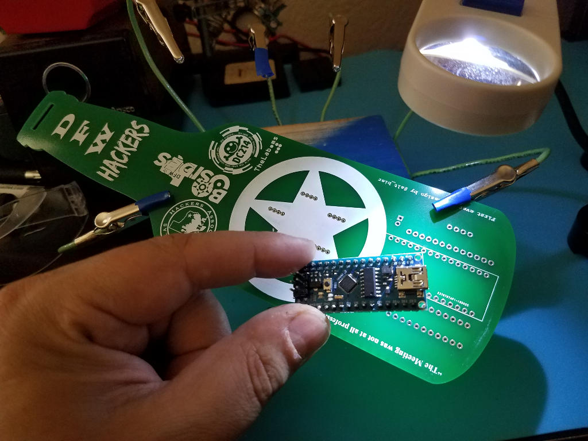
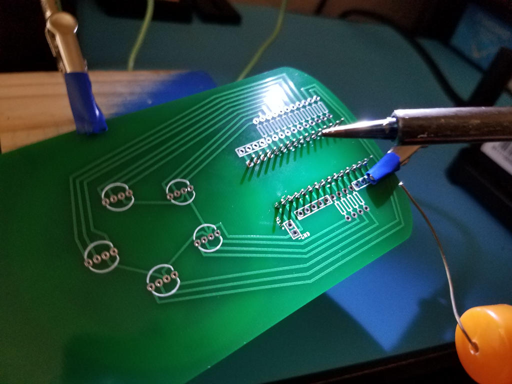
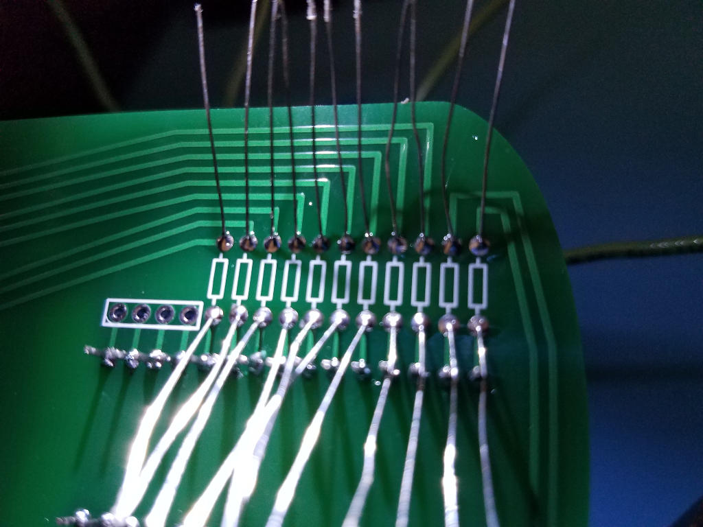
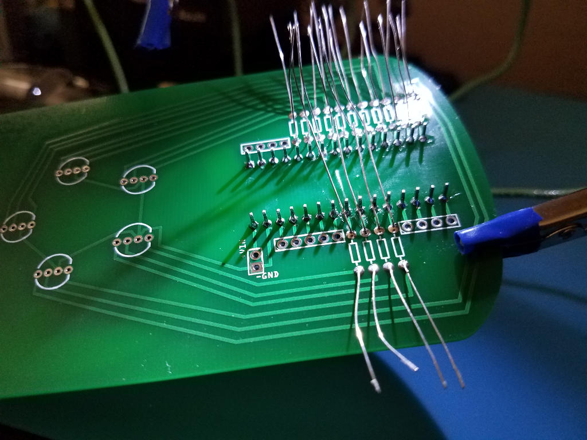
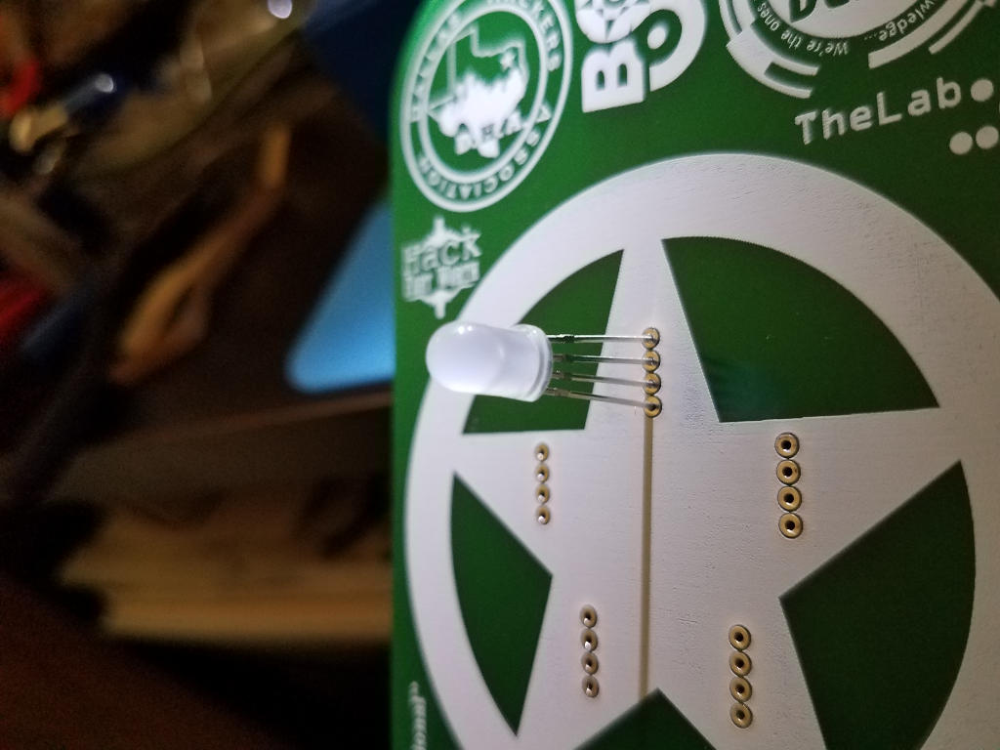
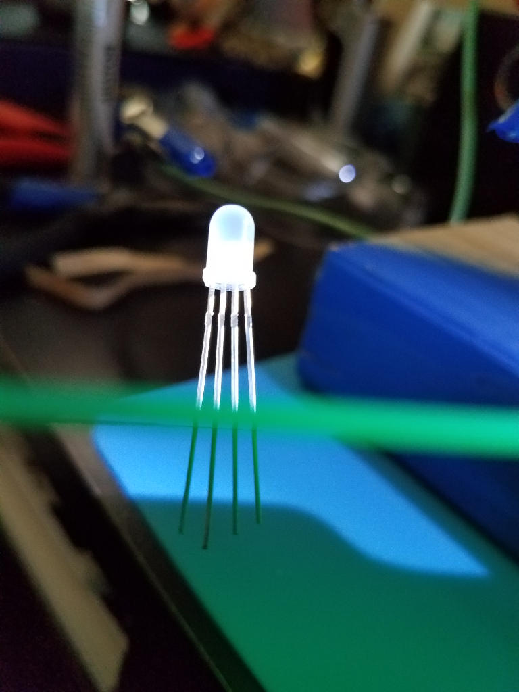
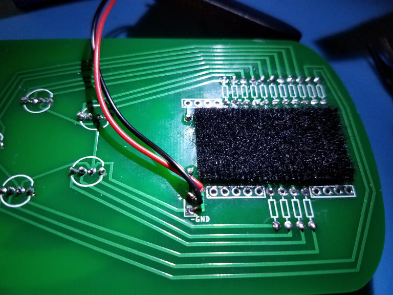
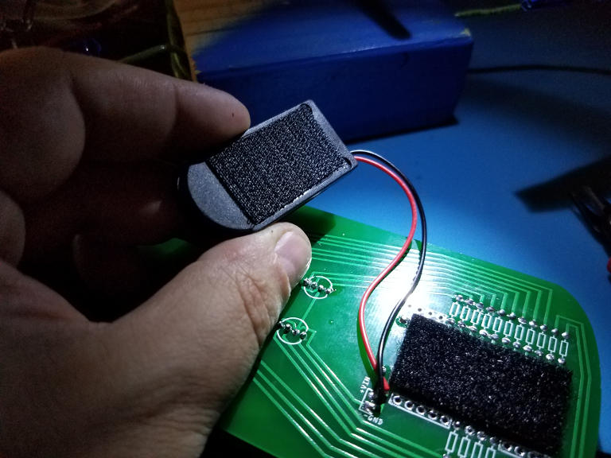

# DFW Hacker Badge Assembly Instructions

This page will walk through the detailed assembly instructions for the DFW Hacker Badge complete with pictures for each step.

If you are new to soldering you should review this training material I put together:
[Electronics Soldering Basics](http://solder.altbier.us/)

If you are new to Electronics or the Arduino you should review this training material I put together:
[Arduino for Beginners](http://arduino.altbier.us/)

Without further preamble here are the instructions:

# The Badge Kit

This is the badge kit you should have.

The are a few choices you need to make before you begin soldering components.

* Which LEDs will you use?  Clear or Diffused?
* Which resistors will you use?  220 ohm or 470 ohm?
* Which battery connector will you use?  6V dual coin cell or 9V?

Once these choices are made it is just a matter of putting the components onto the PCB.

# Prepare you workspace

Make sure you have a safe space to work with the appropriate tools at hand.

# Add the Arduino to the PCB

The Arduino Nano which came in your kit has been designed to be placed in the lower center of
the PCB where the white rectangle is drawn on the front of the PCB.

Plug the Arduino into the front of the PCB by pushing its header pins into the appropriate holes.

It should be a tight fit but make sure the Arduino is pushed all the way down to where the
plastic on the Arduino headers are flush with the PCB surface.

Flip the PCB over so that the header pins poking through are clearly visible.
You will be soldering on this side of the PCB.

Secure the PCB and Solder each pin to the pad surrounding the hole on the PCB.
Press the iron to both the PCB pad and a pin the add solder to join them.
Repeat this process for each of the Nano pins.

Inspect each solder joint and correct as needed.
The solder joints should look like little volcanos.  Any other shape is an indication
of a problem that needs to be corrected.

# Add the resistors to the PCB

Unlike the header pins on the Arduino, the resistors have soft leads that are easy to bend
Bend each resistor into a U shape (with the resistor at the bottom of the U)

Push each resistors leads into appropriate holes in the front of the PCB

Do this for as many resistors as you wish to solder at a time.

This will be a very loose fit so take care to hold the resistors in place as you flip the PCB over
On the back of the PCB bend the leads outward at 45 to 90 degrees to hold the resistor in place

Solder each lead of the resistor to the pad surrounding the hole on the PCB.
Inspect each solder joint and correct as needed.

Repeat this process for the remaining resistors.

# Add the LEDs to the PCB

Prepare to plug an LED into the PCB by orienting the LED correctly so the common cathode
pin goes into the correct hole.
* Each LED will have one pin longer than the others, this is the common cathode pin
* You can tell the common cathode hole on the PCB by looking at the traces on the back
* The common cathode holes for all five LEDs will be connected together by traces

Plug each LED into the front of the PCB by pushing its header pins into the appropriate holes

It'll be a tight fit but make sure the LED is pushed all the way down to the pin stops
These are small extrusions on the LED pins that prevent them from passing thru the holes.
Do not try to force the LED all the way down to where its plastic is touching the PCB.

Flip the PCB over so that the LED pins poking through are clearly visible

Solder each pin to the pad surrounding the hole on the PCB.
Inspect each solder joint and correct as needed

# Trim excess pins and leads

On the backside of the PCB cut the header pins and leads off just above each solder joint.
Be careful not to damage the solder joint while cutting.

When complete the back of the PCB should look fairly level with just small bumps for each solder joint.

# Add the battery connector to the PCB

This assembly guide assumes that you chose to install the 6V two coin cell battery holder instead of the 9V.

Trim the lead wires to the size needed.

Strip the end of each lead wire to expose about 1/4 inch of wire.

"Tin" the lead wires by adding a bit of solder to them.

Plug the bare end of a lead wire into the appropriate power hole in the back of the PCB
Red goes to +VIN and Black goes to -GND
Secure the wire in place so that is does not move in the PCB hole

Solder the wire to the pad surrounding the hole on the PCB.

Repeat this process for the second lead wire.

Trim any excess wire protruding from the front side of the PCB.

Add a piece of Velcro to the back side of the PCB where the battery holder will be placed.

Add a piece of Velcro to the back side of the battery holder

Attach the battery holder to the back of the PCB using the Velcro

If applied correctly the battery holder should be nearly flush with the PCB.

The battery holder takes two CR2032 batteries placed into it in opposite directions.

Be sure you confirm that you a placing the batteries into the holder in the correct position!
Putting the batteries in backwards can cause damage to your Arduino.  So this is important.

The battery holder should snap shut and stay shut.  Verify it is secure.

# Turn it on and enjoy

If everything is done correctly then when you turn it on the preprogrammed Arduino should
start lighting up the LEDs in a color pattern.

I hope this guide is helpful.

-- [@alt_bier](https://twitter.com/alt_bier)

[BACK HOME](/)
