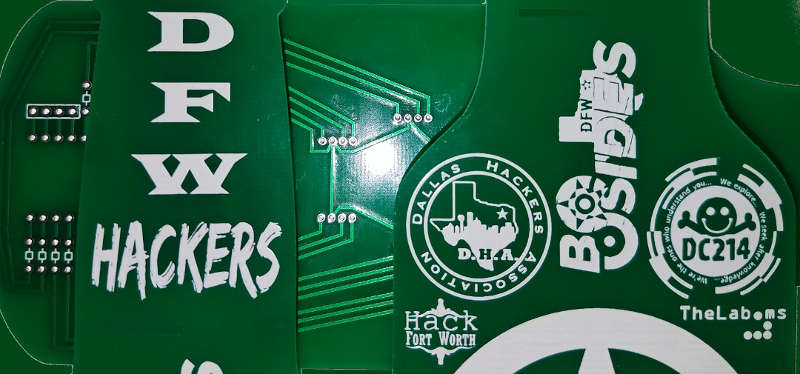
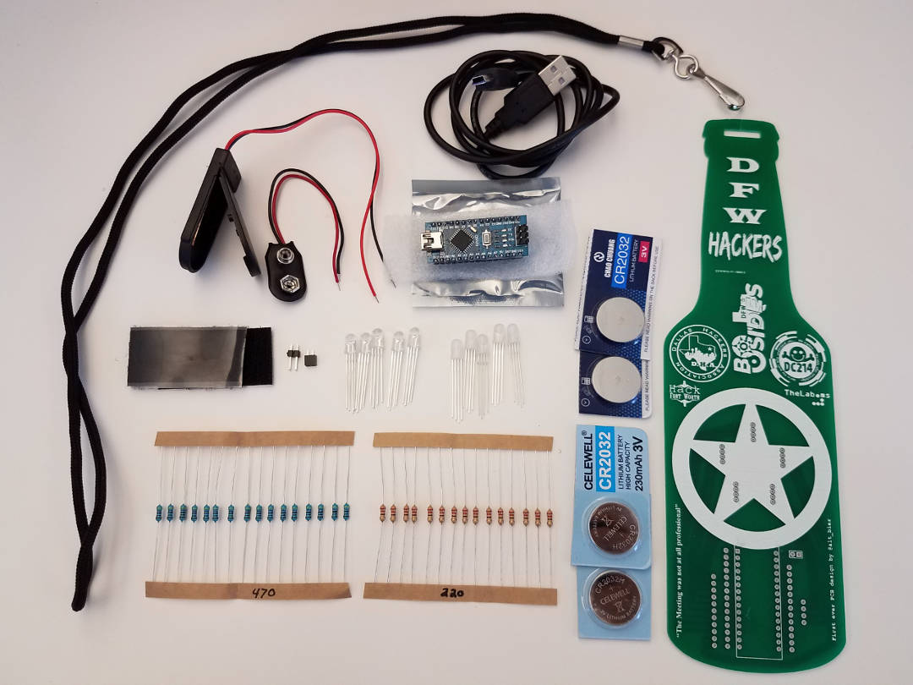

# DFW Hacker Badge

Welcome to the DFW Hacker Badge website.

This is where you will find all the details of our badge including the components in the kit, assembly instructions, and code.

## DIY Badge Say What?!?

This badge is an educational build it yourself kit that will help teach people the following:

* Basic Electronics and Soldering
* Arduino Hardware Development and Programming

Local DFW area badge building classes will be scheduled soon.

## Show Me The Money!

All funds raised by the sale of this badge after production costs will go to BSidesDFW which is a 501c3 non-profit.

These badges will be sold at [BSidesLV](https://www.bsideslv.org/) and [DEFCON](https://defcon.org/).

The kit will cost **$40.00** and just the PCB with no components will cost **$20.00** .

Early bird adopters (DFW area sales prior to hacker summer camp) will get them for half off.

A complete financial overview of the project including production cosrs is stored in the github repo for review.

## What's In The Kit?

The badge kit will contain everything you see pictured below.

Here is a complete list of the items included in the kit:

* 1x Beer Bottle Shaped PCB
* 1x Lanyard (black or green)
* 1x Arduino Nano (pre-loaded with badge code)
* 1x USB A to Mini-B Cable (for programming the Arduino)
* 5x RGB LEDs 5mm 4pin diffused (recommended LEDs)
* 5x RGB LEDs 5mm 4pin clear (optional LEDs to replace above for clear asthetic)
* 15x 470 ohm resistors (recommended resistors)
* 15x 220 ohm resistors (optional to replace above for brighter LEDs and shorter battery life)
* 1x 1x2 male header pins (optional use for power pins)
* 1x 1x2 female header pins (optional use for power pins)
* 1x 6v 2xCR2032 coin cell battery holder (recommended battery holder)
* 4x CR2032 coin cell batteries (two sets for above)
* 1x 9v battery holder (optional replacement for above, 9v battery not included)
* 1 inch of Velcro adhesive strips (for battery holder attachment)

